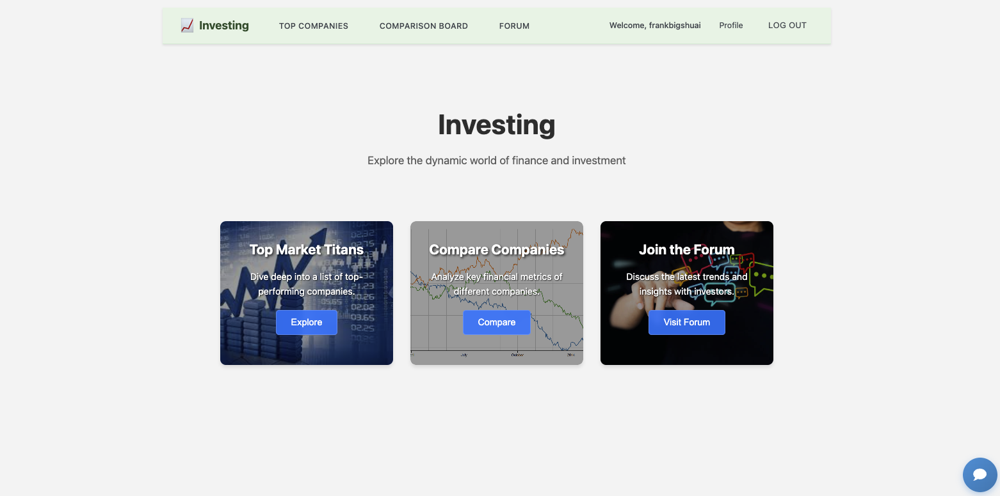

StockWeb - Stock Market Analysis Platform

StockWeb is a full-stack stock market analysis platform providing stock data exploration, company comparison, and investor community features. Built with pure frontend technologies (HTML/CSS/JS) and Flask backend.

Key Features
📈 Stock Data Exploration
View top-performing public companies (Top Market Titans)

Detailed stock information pages (price, financial metrics, company overview)

Real-time stock data (via Alpha Vantage API)

🔍 Company Comparison Tool
Compare up to 4 companies simultaneously

Side-by-side comparison of key financial metrics

Price trend visualization

💬 Investor Forum
User registration/login system

Post and discuss investment ideas

Personal watchlist of favorite stocks

🤖 Intelligent Chat Assistant
OpenAI API-powered financial Q&A system

RAG (Retrieval-Augmented Generation) framework for accurate responses

Stock market-related advice and insights

Technology Stack
Frontend
HTML5, CSS3, JavaScript (ES6)

Pure frontend implementation (no frameworks)

Responsive design

Backend
Python Flask RESTful API

JWT Authentication

RESTful interface design

Databases
MongoDB (primary database)

Redis (caching and session management)

Third-Party Services
Alpha Vantage API (stock data)

OpenAI API (chat assistant)