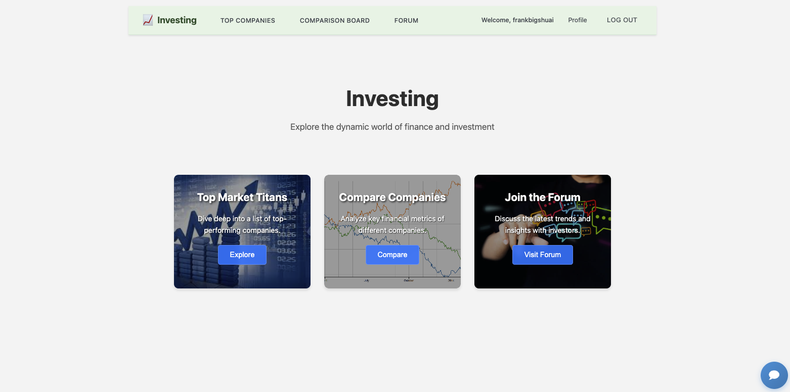

# StockWeb - Stock Market Analysis Platform 🚀

StockWeb is a comprehensive full-stack platform for stock market analysis, providing real-time data exploration, company comparison tools, and an investor community forum. Deployed on Railway for seamless accessibility.

## ✨ Key Features

### 📈 Real-time Market Intelligence
- Top-performing companies dashboard (Top Market Titans)
- Detailed stock profiles with 50+ financial metrics
- Real-time data via Alpha Vantage API integration
- Interactive historical price charts

### 🔍 Advanced Comparison Tools
- Multi-company comparison (up to 4 simultaneously)
- Side-by-side financial metric analysis
- Customizable comparison parameters
- Visual trend overlays

### 💬 Investor Community Hub
- Secure JWT authentication system
- Discussion forums for investment strategies
- Personalized stock watchlists
- User profile management

### 🤖 AI Financial Assistant
- OpenAI-powered natural language interface
- RAG-enhanced response accuracy
- Market insights and analysis
- Investment strategy suggestions

## 🛠 Technology Stack

### Frontend
- Vanilla JavaScript (ES6+) - No framework dependencies
- Semantic HTML5 and modern CSS3
- Fully responsive design (mobile/tablet/desktop)
- Chart.js for data visualization

### Backend
- Python Flask RESTful API
- JWT authentication middleware
- Rate limiting and API security
- Efficient request handling

### Data Infrastructure
- MongoDB Atlas - Scalable document storage
- Redis - High-performance caching layer
- Automated data refresh pipelines

### Integrated Services
- Alpha Vantage API - Real-time market data
- OpenAI API - Intelligent chat responses
- Railway - Cloud deployment platform

## 🚀 Deployment

StockWeb is deployed on [Railway](https://railway.app/) for reliable cloud hosting:
- Automatic CI/CD pipeline
- Scalable infrastructure
- HTTPS encryption
- Global CDN distribution

👉 [Live Demo Available Here](https://stockweb-production.up.railway.app/)

## 📚 Documentation

For developers interested in contributing or running locally:
1. Clone the repository
2. Set up environment variables (see `.env.example`)
3. Install dependencies with `pip install -r requirements.txt`
4. Run `flask run` for development server

## 🤝 Contributing

We welcome contributions! Please:
- Fork the repository
- Create a feature branch
- Submit a pull request

## 📜 License

MIT License - Free for open source and educational use

---

💡 **Pro Tip:** Bookmark the live demo to track your favorite stocks daily!